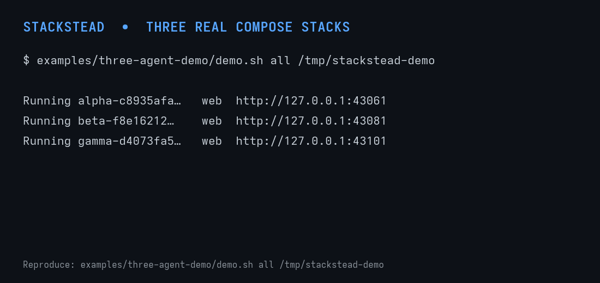

# Stackstead

**Run parallel coding agents against your real app—without sharing ports,
services, or databases.**

> **Early access:** Stackstead is pre-1.0 software for macOS and glibc Linux
> repositories that use Docker Compose. Contracts may change between any
> pre-1.0 releases, including patches; pin matching binaries and manager hooks.

- **Your real stack:** reuse the existing Compose topology instead of maintaining
  a second agent-specific environment.
- **One identity:** source, services, ports, data, URLs, and lifecycle belong to
  one durable environment ID.
- **Safe teardown:** clean up one agent’s runtime without touching another
  agent’s work or state.

Stackstead works with Codex, Claude Code, Cursor, other coding agents, and
worktree managers. [Why Stackstead?](docs/why-stackstead.md)

## Install

```sh
curl -fsSL https://github.com/yazanabuashour/stackstead/releases/latest/download/install.sh | sh
```

This installs the latest checksummed binary to `~/.local/bin`. Stackstead
requires Git plus Docker with the Compose plugin. See
[Installation](docs/install.md) for supported platforms, pinned releases, and
building from source.

## Try it

In a repository already configured for Stackstead:

```sh
stackstead launch feature-a -- claude
```

Stackstead creates the worktree, allocates ports, starts the Compose runtime,
and runs the command inside that exact environment. Replace `claude` with any
agent or command. To add Stackstead to an existing Compose repository, give your
coding agent the [setup guide](docs/agent-setup.md) and this prompt:

> Set up Stackstead in this repository. Follow the Stackstead agent setup guide,
> reuse the existing Compose setup, make the smallest changes needed, and show
> me the diff before committing.

Prefer to do it yourself? Follow the [manual quickstart](docs/quickstart.md).

## Core workflow

```sh
stackstead ps
stackstead inspect <full-id>
stackstead run <full-id> -- npm test
stackstead exec <full-id> api -- npm test
stackstead stop <full-id>
stackstead destroy <full-id> --yes
```

Use the full ID printed by `launch` for scripts and runtime-sensitive commands.
Inside an environment, use `$STACKSTEAD_ID` directly.

## Isolation proof



The reproducible [three-agent demo](examples/three-agent-demo/README.md) starts
three real Nginx/Postgres stacks, proves their ports and databases are isolated,
recovers one after failure, and removes it without touching its peers. The same
proof runs in CI.

## Existing worktree managers

Stackstead can adopt an externally managed checkout while preserving manager
ownership. Ready-to-use Worktrunk, workmux, webmux, and generic hooks live in
[`integrations/`](integrations); see [Manager integrations](docs/integrations.md)
for the lifecycle and teardown contract.

## Learn and participate

- [Documentation index](docs/README.md)
- [Reliability evidence](docs/reliability.md)
- [Early adopter program](docs/early-adopters.md)
- [Contributing](CONTRIBUTING.md) · [Security policy](SECURITY.md)
